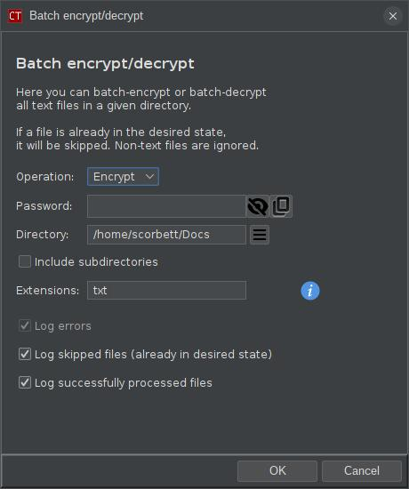
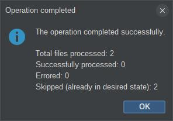

# ext-ct-batch

## What is this?

This is an extension for the [CryptText](https://github.com/scorbo2/crypttext) application which allows
batch encrypting or decrypting of files. Select "Batch encrypt/decrypt" from the "Crypt" menu, or
hit `Ctrl+B` (by default) to open the batch dialog:



Here, you can configure the batch operation with the following options:

- **Operation**: whether to encrypt or decrypt the selected files.
- **Password**: the password to use for encryption or decryption. This is required for both operations. Note that the
  given password is only kept in memory for the duration of the batch operation, and then immediately discarded.
- **Directory**: the directory to search for files to encrypt or decrypt.
- **Include subdirectories**: check this to include files in subdirectories of the selected directory.
- **Extensions**: a comma-separated list of file extensions to consider (without dots). The default value is "txt",
  meaning `*.txt` files will be encrypted or decrypted. You can include additional file extensions with commas (
  whitespace is ignored). For example: `txt, md, json` would include `*.txt`, `*.md`, and `*.json` files. Leave this
  field blank to scan for ALL files. However, note that binary files (non-text) are detected and skipped automatically.
  CryptText only works with text-based files.
- **Log errors**: this option is always checked and can't be unselected. If an error occurs during the batch operation,
  details will appear in the log file.
- **Log skipped files**: select this to include a log entry every time a file is skipped. This can happen if the given
  file is already in the desired state. For example, if Operation is "Encrypt", and a file that is already encrypted is
  encountered, it will be skipped. If this option is unselected, such events will not be logged.
- **Log successfully processed lines**: select this to include a log entry every time a file is successfully encrypted
  or decrypted. If this option is unselected, only errors and skipped files will be logged.

Hit OK to begin the operation. A progress dialog will appear, and the log will be updated in real time as files are
processed. At any point, you can hit the Cancel button on the progress dialog to stop the operation. Note that canceling
an operation in progress will not undo any changes that have already been made to files. For example, if you are
encrypting a batch of files and cancel halfway through, the files that were encrypted before canceling will remain
encrypted.

A summary dialog is displayed when the operation is completed (or canceled):



If the operation completed normally, the batch dialog will be dismissed as soon as the summary is closed.
If the operation was canceled, the batch dialog will remain open, so that you can try again if desired.

## How do I get it?

### Option 1: dynamic download and install

The easiest option is to use the built-in extension manager dialog in CryptText. Select "Extension Manager"
from the "Edit" menu, and navigate to the "Available" tab. Find the "Batch" extension in the list on the left
and select it. An "Install" button will appear in the top right. Click it to download and install the extension
automatically. You will be prompted to restart the application. When CryptText restarts, you should find
the batch dialog is now available under the "Crypt" menu.

To uninstall the extension later, revisit the extension manager dialog, and select the "Batch" extension
on the "Installed" tab. An "Uninstall" button will appear in the top right. Click it to remove the extension.
You will again be prompted to restart the application. When CryptText restarts, the batch dialog will no
longer be available.

### Option 2: manual build from source

You can clone the project repo and build manually with Maven (Java 17 required):

```shell
git clone https://github.com/scorbo2/ext-ct-batch.git
cd ext-ct-batch

# NOTE! You must have CryptText-1.x in your local maven repository for this to work!
mvn clean package 

# Optionally remove any older versions before proceeding:
rm ~/.CryptText/extensions/ext-ct-batch-*.jar

# Now copy the result to the extensions directory:
cp target/ext-ct-batch-*.jar ~/.CryptText/extensions
```

Simply restart CryptText if it was already running, and the extension should be available.
To uninstall later, just delete the jar from the extensions directory and restart the application again.

## Requirements

Compatible with any `1.x` version of CryptText.

## License

CryptText and this extension are licensed under the [MIT License](LICENSE).
